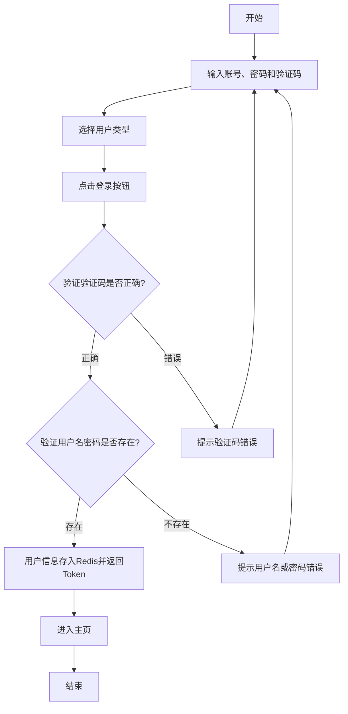
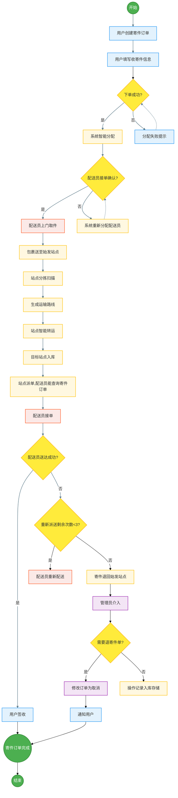

```mermaid
graph TD
    Start[开始] --> Input[输入账号、密码和验证码]
    Input --> SelectType[选择用户类型]
    SelectType --> Login[点击登录按钮]
    Login --> VerifyCaptcha{验证验证码是否正确?}
    VerifyCaptcha -->|正确| VerifyUser{验证用户名密码是否存在?}
    VerifyCaptcha -->|错误| CaptchaError[提示验证码错误]
    CaptchaError --> Input
    VerifyUser -->|存在| SaveRedis[用户信息存入Redis并返回Token]
    VerifyUser -->|不存在| UserError[提示用户名或密码错误]
    UserError --> Input
    SaveRedis --> Home[进入主页]
    Home --> End[结束]
```

```mermaid
%%{init: {'theme': 'base', 'themeVariables': { 'primaryColor': '#fff'}}}%%
graph TD
    %% ========== 全局样式定义 ==========
    classDef startEnd fill:#4CAF50,stroke:#388E3C,color:white,stroke-width:2px
    classDef user fill:#E3F2FD,stroke:#2196F3,stroke-width:1.5px
    classDef courier fill:#FBE9E7,stroke:#FF5722,stroke-width:1.5px 
    classDef station fill:#FFF8E1,stroke:#FFC107,stroke-width:1.5px
    classDef admin fill:#F3E5F5,stroke:#9C27B0,stroke-width:1.5px
    classDef decision fill:#FFEB3B,stroke:#FBC02D,stroke-width:2px

    %% ========== 用户流程 ==========
    Start((开始)):::startEnd --> UserOrder[用户创建寄件订单]:::user
    UserOrder --> FillInfo[用户填写收寄件信息]:::user
    FillInfo --> Payment{下单成功?}:::decision
    Payment -->|是| SystemAssign[系统智能分配]:::station
    Payment -->|否| PaymentFail[分配失败提示]:::user
    PaymentFail -.-> Payment

    %% ========== 配送员流程 ==========
    SystemAssign --> CourierAccept{配送员接单确认?}:::decision
    CourierAccept -->|是| Pickup[配送员上门取件]:::courier
    CourierAccept -->|否| Reassign[系统重新分配配送员]:::station
    Reassign -.-> CourierAccept
    Pickup --> ToStation[包裹送至始发站点]:::station

    %% ========== 站点处理流程 ==========
    ToStation --> Sorting[站点分拣扫描]:::station
    Sorting --> RoutePlan[生成运输路线]:::station
    RoutePlan --> Transfer[站点智能转运]:::station
    Transfer --> StationScan[目标站点入库]:::station
    StationScan --> Outbound[站点派单,配送员能查询寄件订单]:::station

    %% ========== 末端配送流程 ==========
    Outbound --> Deliver[配送员接单]:::courier
    Deliver --> ArrivalCheck{配送员送达成功?}:::decision
    ArrivalCheck -->|是| UserConfirm[用户签收]:::user
    ArrivalCheck -->|否| Retry{重新派送剩余次数<3?}:::decision
    Retry -->|是| Redeliver[配送员重新配送]:::courier
    Retry -->|否| Return[寄件退回始发站点]:::station
    UserConfirm --> Finish((寄件订单完成)):::startEnd

    %% ========== 异常处理流程 ==========
    Return --> AdminProcess[管理员介入]:::admin
    AdminProcess --> RefundCheck{需要退寄件单?}:::decision
    RefundCheck -->|是| Audit[修改订单为取消]:::admin
    RefundCheck -->|否| Warehouse[操作记录入库存储]:::station
    Audit --> NotifyUser[通知用户]:::user
    NotifyUser --> Finish

    Finish --> End((结束)):::startEnd

    %% ========== 布局优化指令 ==========
    linkStyle 0,1,3,4,5,6,7,8,9,10,11,12,13,14,15,16,17,18,19 stroke:#607D8B,stroke-width:1.5px
```

```mermaid
%%{init: {'theme': 'base', 'themeVariables': { 'primaryColor': '#fff'}}}%%
graph LR
    %% ========== 全局样式定义 ==========
    classDef startEnd fill:#4CAF50,stroke:#388E3C,color:white,stroke-width:2px
    classDef user fill:#E3F2FD,stroke:#2196F3
    classDef courier fill:#FBE9E7,stroke:#FF5722
    classDef station fill:#FFF8E1,stroke:#FFC107
    classDef admin fill:#F3E5F5,stroke:#9C27B0
    classDef decision fill:#FFEB3B,stroke:#FBC02D,stroke-width:2px

    %% ========== 左侧用户流程 ==========
    subgraph 用户侧
    Start((开始)):::startEnd --> UserOrder[创建寄件订单]:::user
    UserOrder --> FillInfo[填写信息]:::user
    FillInfo --> Payment{支付成功?}:::decision
    Payment -->|是| SystemAssign
    Payment -->|否| PaymentFail[支付失败]:::user
    PaymentFail -.-> Payment
    end

    %% ========== 右侧配送流程 ==========
    subgraph 配送侧
    SystemAssign[系统分配]:::station --> CourierAccept{接单确认?}:::decision
    CourierAccept -->|是| Pickup[上门取件]:::courier
    CourierAccept -->|否| Reassign[重新分配]:::station
    Reassign -.-> CourierAccept
    end

    %% ========== 中部站点流程 ==========
    subgraph 站点处理
    Pickup --> ToStation[包裹入站]:::station
    ToStation --> Sorting[分拣扫描]:::station
    Sorting --> RoutePlan[生成路线]:::station
    RoutePlan --> Transfer[智能转运]:::station
    Transfer --> StationScan[目标入库]:::station
    StationScan --> Outbound[末端派单]:::station
    end

    %% ========== 底部配送流程 ==========
    subgraph 末端配送
    Outbound --> Deliver[配送接单]:::courier
    Deliver --> ArrivalCheck{送达成功?}:::decision
    ArrivalCheck -->|是| UserConfirm[用户签收]:::user
    ArrivalCheck -->|否| Retry{剩余次数<3?}:::decision
    Retry -->|是| Redeliver[重新配送]:::courier
    Retry -->|否| Return[退回站点]:::station
    UserConfirm --> Finish((完成)):::startEnd
    end

    %% ========== 右侧异常处理 ==========
    subgraph 异常处理
    Return --> AdminProcess[管理员介入]:::admin
    AdminProcess --> RefundCheck{需要退单?}:::decision
    RefundCheck -->|是| Audit[修改订单]:::admin
    RefundCheck -->|否| Warehouse[入库存储]:::station
    Audit --> NotifyUser[通知用户]:::user
    NotifyUser --> Finish
    end

    Finish --> End((结束)):::startEnd

    %% ========== 布局样式 ==========
    linkStyle 0,1,2,3,4,5,6,7,8,9,10,11,12,13,14,15,16,17,18,19 stroke:#607D8B,stroke-width:1.5px
```
